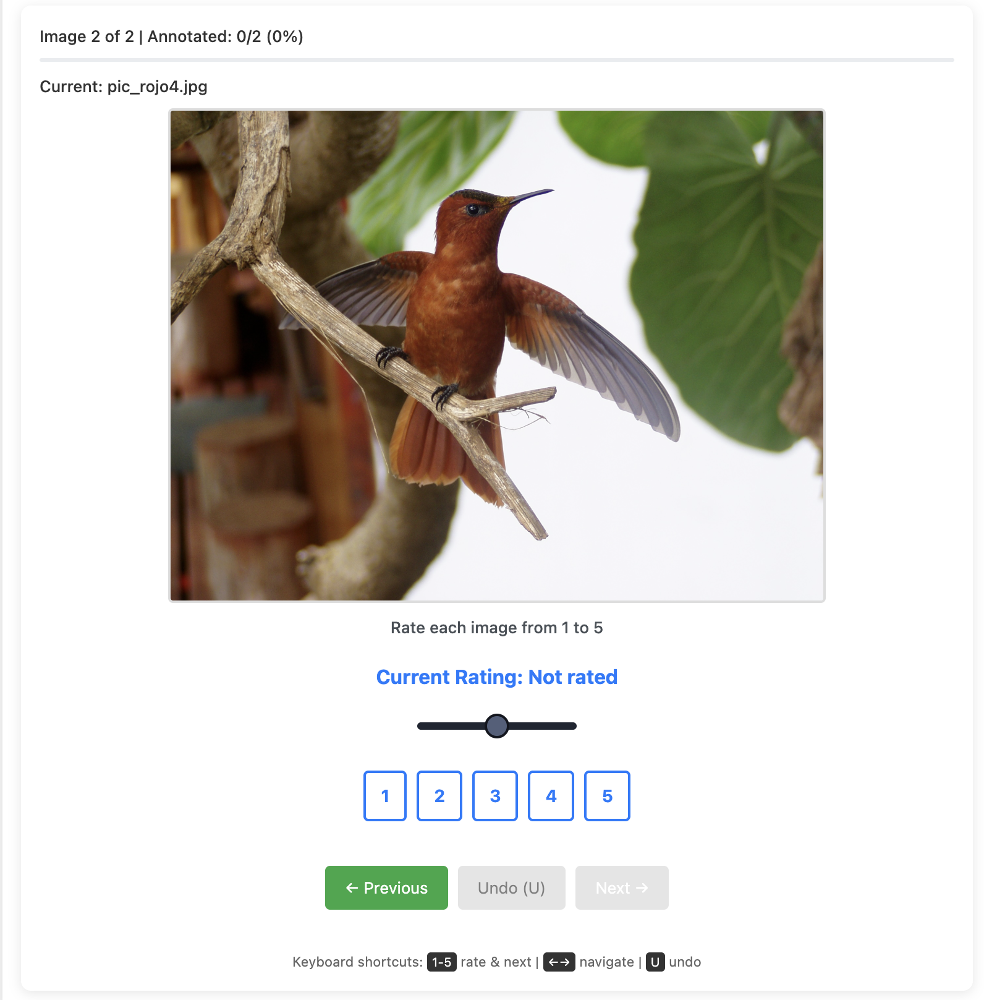

# Fast Image Annotation



A FastHTML image annotator - Simple, keyboard-driven image annotation tool built with FastHTML.


## Features

- **Fast annotation** - Keyboard shortcuts (1-5 keys) for instant rating and auto-advance
- **Mark problematic images** - Flag images that can't be annotated or have issues (X key)
- **Smart resume** - Automatically starts from the first unannotated image
- **Undo support** - Quickly fix mistakes with the U key
- **Progress tracking** - Visual progress bar with annotation and marking statistics
- **Multi-user support** - Tracks username and timestamp for each annotation
- **SQLite database** - Persistent storage with efficient queries
- **Filter mode** - Show only unannotated images
- **Configurable** - YAML-based configuration for flexibility

## Quick Start

```bash
# Clone and install
git clone https://github.com/yourusername/fast_image_annotation.git
cd fast_image_annotation
pip install .

# Configure (edit config.yaml)
# Place images in images/ folder

# Run with uv (recommended)
uv run python main.py

# Or with regular Python
python main.py
```

Open browser to `http://localhost:5001`

## Keyboard Shortcuts

| Key | Action |
|-----|--------|
| `1-5` | Rate and advance to next |
| `X` | Mark/unmark current image (problematic/can't annotate) |
| `Left/Right Arrow` | Navigate images |
| `U` | Undo last annotation |

## Configuration

Edit `config.yaml`:

```yaml
title: "Image Annotation Tool"
description: "Rate each image from 1 to 5"
num_classes: 5  # Number of rating classes
images_folder: "images"  # Folder containing images to annotate
max_history: 10  # Number of undo operations to keep
```

## Database Schema

Annotations are stored in SQLite database (`annotations.db`):

| Column | Type | Description |
|--------|------|-------------|
| id | INTEGER | Primary key |
| image_path | TEXT | Image filename |
| rating | INTEGER | Rating value (1-num_classes, 0 if not rated) |
| username | TEXT | System username |
| timestamp | TEXT | ISO format timestamp |
| marked | BOOLEAN | Flag for problematic/unannotatable images |

## Project Structure

```
main.py              # FastHTML application (single file)
config.yaml          # User configuration
annotations.db       # SQLite database (created automatically)
images/              # Image folder
pyproject.toml       # Project metadata and dependencies
```

## Development

The app uses FastHTML's single-file pattern for simplicity:
- Database models and routes in `main.py`
- SQLite for persistence (no CSV files)
- HTMX for dynamic updates without full page reloads
- Clean state management with in-memory tracking

## License

MIT License - see [LICENSE](LICENSE) file.

## Acknowledgments

Built with [FastHTML](https://github.com/AnswerDotAI/fasthtml) - The fast, Pythonic way to create web applications.